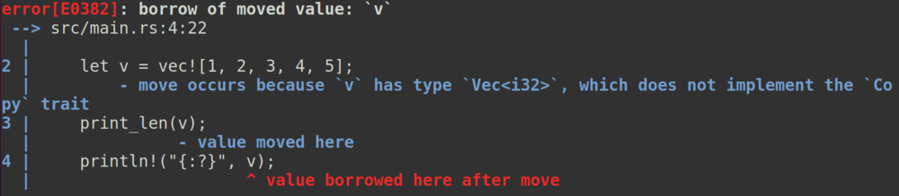
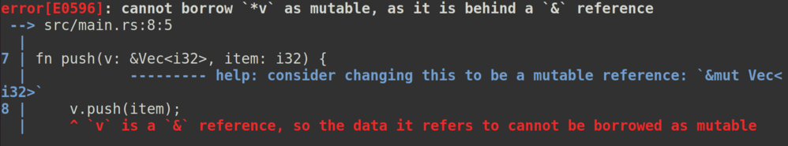

# Концепция Rust

## Введение 

Любой программист, начавший изучать Rust, обязан прочитать rustbook ([eng](https://doc.rust-lang.org/book/) [ru](https://doc.rust-lang.ru/book/)). Но лично у меня после прочтения статей [ownership](https://doc.rust-lang.org/book/ch04-01-what-is-ownership.html), [borrowing](https://doc.rust-lang.org/book/ch04-02-references-and-borrowing.html), и серии статей [smart pointers](https://doc.rust-lang.org/book/ch15-00-smart-pointers.html) не сложилось общей концепции в голове, не смотря на то что я на каком-то уровне знаю С++ и понимаю RAII. Эта статья не является официальной документацией к языку, и в ней могут содержаться некоторые неточности для простоты объяснения, но является попыткой привести знания из rustbook к общей концепции.

## Экскурс

Быстро пробежимся по вышеупомянутым статьям rustbook на основе примеров кода.

## Ownership

Вот простой код на rust:

```rust
fn main() {
    let v = vec![1, 2, 3, 4, 5];
    print_len(v);
    println!("{:?}", v);
}

fn print_len(v: Vec<i32>) {
    println!("{}", v.len());
}
```

Мы создаем вектор чисел, передаем его в функцию печати длины вектора, а затем выводим содержимое. Но этот код не компилируется:



Компилятор выдает ошибку, так как при вызове функции `print_len` вектор **перемещается**, то есть **владение** вектором передается функции. И после того, как функция завершится, вектор сразу же будет уничтожен (выделенная вектору память вернется операционной системе). А следовательно после вызова функции `print_len` использовать вектор больше нельзя. 

Аналогичный код на C++ может выглядеть так:

```cpp
#include <vector>
#include <iostream>
using namespace std;

void print_len(vector<int> v) {
    cout << v.size() << endl;
}

int main() {
    vector<int> v{1, 2, 3, 4, 5};
    
    print_len(move(v));

    for (auto item : v) {
        cout << item << " ";
    }
    cout << endl;
    return 0;
}
```

Здесь стоит обратить внимание на функцию `move`, которая как раз перемещает вектор. Код скомпилируется. Что будет при его запуске и почему можете изучить самостоятельно, объяснение выходит за рамки статьи.

## Borrowing

Можно ли как-то заставить код из предыдущего примера компилироваться? Да, но нужно не передавать владение вектором функции `print_len`, а сделать так чтоб функция **заимствовала** вектор. Для этого необходимо передать не сам вектор, а ссылку на него:

```rust
fn main() {
    let v = vec![1, 2, 3, 4, 5];
    print_len(&v);
    println!("{:?}", v);
}

fn print_len(v: &Vec<i32>) {
    println!("{}", v.len());
}
```

Теперь код компилируется и работает так, как мы ожидаем. К слову в C++ аргумент также можно передавать по ссылке:

```cpp
#include <vector>
#include <iostream>
using namespace std;

void print_len(vector<int> &v) {
    cout << v.size() << endl;
}

int main() {
    vector<int> v{1, 2, 3, 4, 5};

    print_len(v);

    for (auto item : v) {
        cout << item << " ";
    }
    cout << endl;
    return 0;
}
```

Немного модифицируем наш пример:

```rust
fn main() {
    let v = vec![1, 2, 3, 4, 5];
    push(&v, 6);
    println!("{:?}", v);
}

fn push(v: &Vec<i32>, item: i32) {
    v.push(item);
}
```

Код снова перестал компилироваться:



На этот раз в сообщении об ошибке говорится о том, что вектор передается по immutable ссылке, по которой изменить вектор нельзя. Для того чтобы изменить вектор, необходимо передать его по mutable ссылке:

```rust
fn main() {
    let mut v = vec![1, 2, 3, 4, 5];
    push(&mut v, 6);
    println!("{:?}", v);
}

fn push(v: &mut Vec<i32>, item: i32) {
    v.push(item);
}
```
